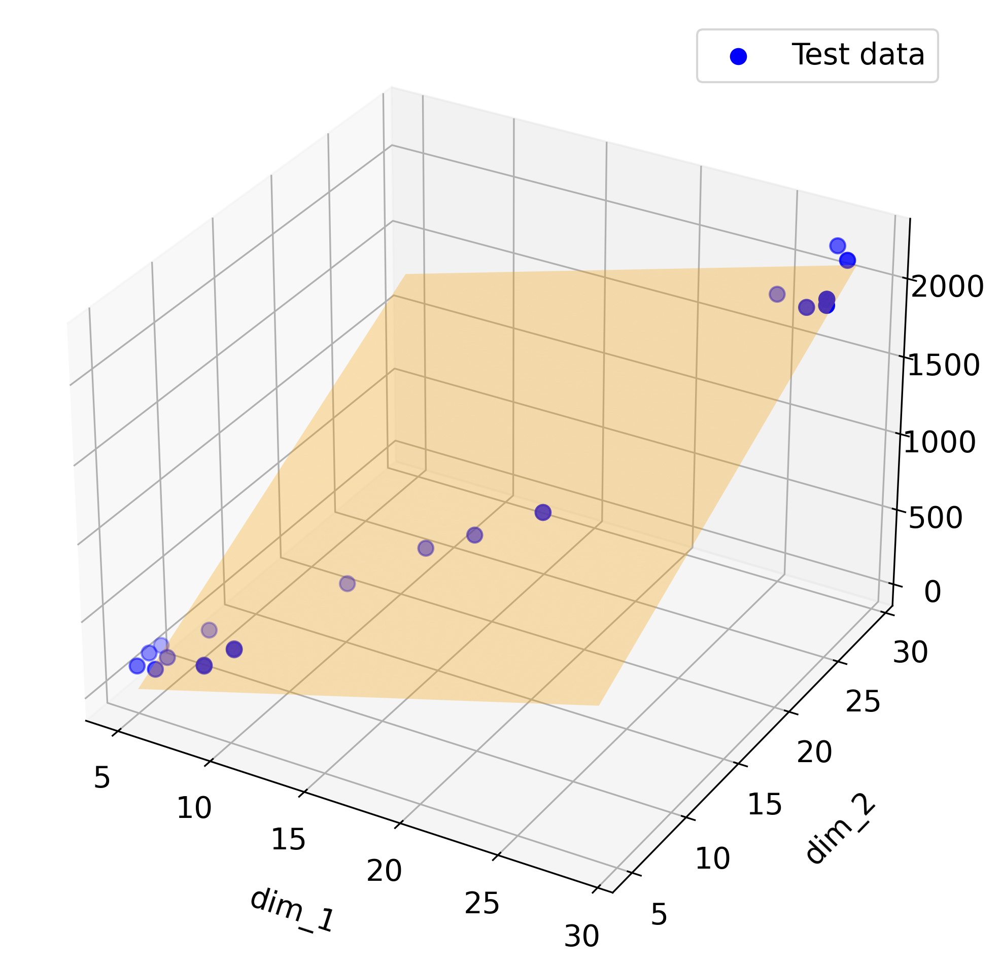
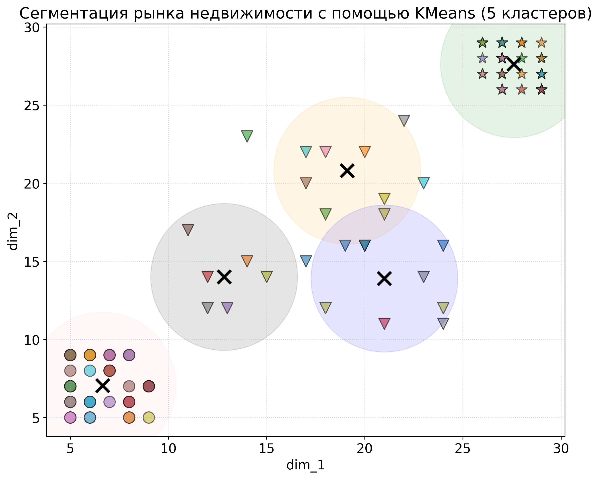

# Real Estate Analytics & Machine Learning Project 🏢

An end-to-end data science project focused on real estate data analysis, property type classification, and price prediction using machine learning algorithms.

## 🎯 Project Overview
This project solves three core tasks using a dataset of property characteristics:
1. **Regression:** Predicting house prices based on geometric dimensions (`dim_1`, `dim_2`).
2. **Classification:** Categorizing houses into comfort levels (`basic`, `medium`, `luxury`).
3. **Clustering:** Segmenting the housing market into distinct clusters to find hidden patterns.

## 🛠️ Tech Stack
- **Language:** Python
- **Data Libraries:** Pandas, NumPy
- **Machine Learning:** Scikit-Learn (LinearRegression, DecisionTreeClassifier, KMeans)
- **Visualization:** Matplotlib (including 3D plotting)

## 📁 Repository Structure
```text
├── data/
│   └── 1.4_houses.csv           # Source dataset
├── src/
│   └── real_estate_analysis.ipynb # Main Jupyter Notebook with code and steps
├── README.md                    # Project documentation
└── requirements.txt             # Environment dependencies
```

## 📊 Key Visualizations

### 1. 3D Linear Regression Plane
The model fits a regression plane to predict property prices based on two geometric dimensions.


### 2. Market Segmentation (KMeans Clustering)
Properties are segmented into 5 distinct groups based on spatial features.


### 3. Decision Tree Rules
A visualized tree demonstrating how the model classifies house comfort levels.


## 🚀 How to Run Locally

1. Clone this repository:
   ```bash
   git clone https://github.com/ctrlkva/real-estate-analytics-ml
   cd real-estate-analytics-ml
   ```

2. Install dependencies:
   ```bash
   pip install -r requirements.txt
   ```

3. Open and run the notebook:
   ```bash
   jupyter notebook src/real_estate_analysis.ipynb
   ```